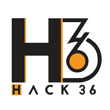

<h1 align="center">EagleEye</h1>

## Introduction:
  The gaming community of today faces one common problem : Hackers. Although each multiplayer games comes equipped with a anti-cheat system, these system are not able to detect hackers using external cheats. The way these hackers are detected are by reporting them and then manually watching the gameplay of the player to determine if the person is a hacker or not. This is where EagleEye comes in. With EagleEye, we aim to automate the detection of these hackers by using demo file created of the match and finding inconsitencies in the player play pattern.
  
## Table of Contents:

1) [Requirements](#ret)
2) [Technology Stack](#depend)
3) [Feedback](#feed)
4) [Contribute](#contri)

## Requirements:
* Scikit-Learn
* Pandas
* <a href="https://github.com/saul/demofile">DemoFile</a>
* Jfoenix
  

## Technology Stack:
  1) Node.JS
  2) Google Collab
  3) Javafx
  4) Machine Learning
  
  
## Feedback:
Feel free to file an issue if you come across any bugs

## Contribute:
* Feel free to report issues and bugs. It will be helpful for future lauches of the application
* All suggestions are welcome
* Fork repository and contribute

## Contributors:

* [Anshul Singh](github.com/iosdev747)
* [Arsh Singh](github.com/iosdev474)
* [Ayush Jaiswal](github.com/ayush2709)
* [Chitranshu Srivastava](github.com/chitranshu651)

### Made at:

Logo generated by <a href="https://www.designevo.com/logo-maker/" title="Free Online Logo Maker">DesignEvo free logo designer</a>

~~ BUILD IN PROGRESS :-) 
 
  
 
